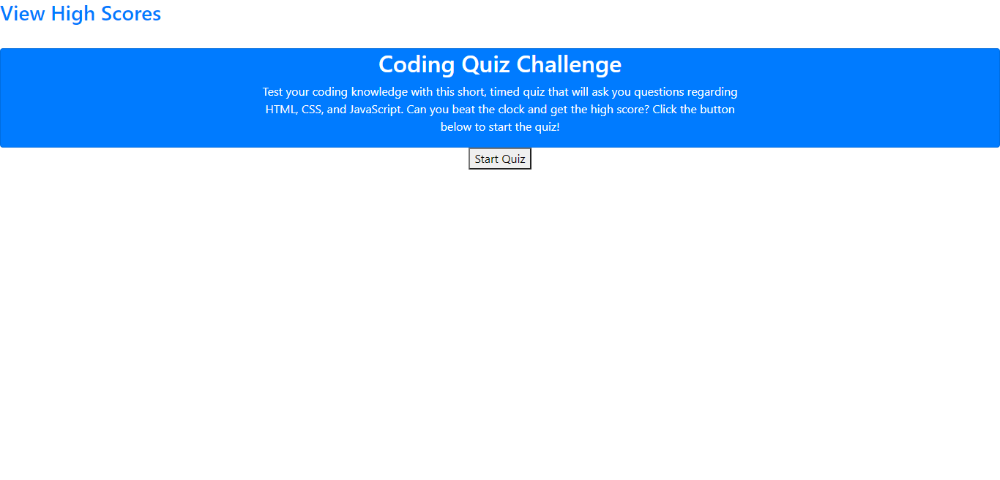
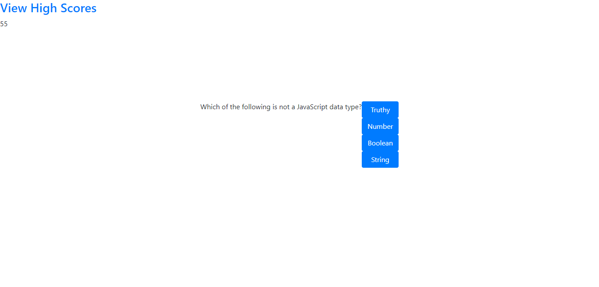

# Coding Quiz Challenge

## Goals

In this assignment, the goal was to create a quiz app that cycles through questions, has a countdown timer and can save the scores of the players. I created the quiz using HTML, JavaScript and some CSS and Bootstrap for light styling. I included a second HTML page for displaying player scores. Below find a screenshot of the application as well as a live link.

